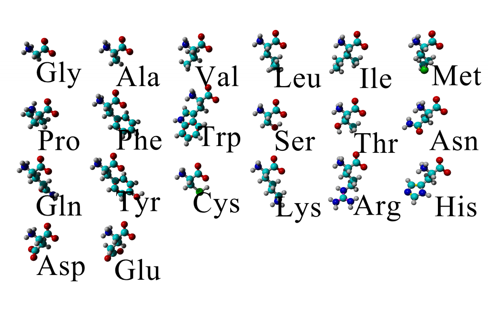
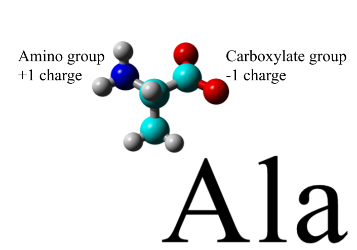

```{r setup, include=FALSE}
knitr::opts_chunk$set(echo = TRUE)

library(tidyverse)
library(Peptides)
library(kableExtra)

```


## Amino acids and proteins

*Amino acids* are one type of *biomolecule* that form chains called *proteins*. The 20 canonical amino acids are shown in Figure 1 with the three letter abbreviation for each amino acid. For more information on the 20 amino acids following this [link](https://www.ncbi.nlm.nih.gov/books/NBK22379/).


```{r aapic, echo=FALSE, message=FALSE, warning=FALSE, fig.cap="The 20 canonical aminos acids and their 3 letter abbreviations"}
# AA pic from YASARA scene




```


## Ionizable groups

Each amino acid has *ionizable groups* which can be *protonated* or *deprotonated*. What this means is that certain atoms or functional groups on each amino acid are more likely to gain or lose an H^+^, which is called a *proton*. In Figure 2 a picture of the amino acid Alanine is shown with the two groups that can be (de)protonated. The *amino* group (-NH~3~^+^) is normally positively charged until it loses a proton when it become -NH~2~. The *carboxylic acid* group (-COOH) is normally neutral until it loses a proton and becomes a *carboxylate* group with a negative charge (-COO^-^). The picture in Figure 2 is shown as the groups would be at neutral pH or ~7. 

```{r alapic, echo=FALSE, message=FALSE, warning=FALSE, fig.cap="The amino acid alanine and the two ionizable groups on the amino acid. The groups are shown with the charges that they would have at pH 7"}
# pic of alanine from YASARA with highlights of ionizable groups



```


A complete description of amino acids and the ionizable groups within proteins are shown [here](https://www.ncbi.nlm.nih.gov/books/NBK22379/) or in a [concise table](https://www.ncbi.nlm.nih.gov/books/NBK21180/).

## pK~A~ values

The parameter that dictates whether a group is protonated is the acid dissociation constant or *K~A~* value which is shown mathematically below. 

$$K_A = \frac{[H^+][A]}{[HA]}$$

The K~A~ is the equilibrium constant describing the concentration of acid (HA) and base (A) forms typically at 25 ^o^C. For strong acids like hydrochloric acid (HCl) or sulfuric acid (H~2~SO~4~) the K~A~ value is greater than one because these acids are fully dissociated under normal conditions and there is very little of the HA form in solution. Amino acids are not strong acids however, they are *weak acids*, which means they are only partially dissociated in solution and there are measurable amounts of both HA and A forms in solution.

A K~A~ value is useful but still hard to use because it is not easy to see at a given pH value whether a molecule is most protonated or deprotonated. To put pH and K~A~ in the same reference frame usually biochemists use the *pK~A~* value.

$$pK_A = -log(K_A)$$

Now we have both pH and pK~A~ on the same scale we can easily tell if a group is deprotonated. As a general rule if pH > pK~A~, then the weak acid is deprotonated because K~A~ would be very large. If pH < pK~A~, then the weak acid is protonated because K~A~ would be small. If pH ~ pK~A~, then it gets more complex and we will address this in a later section. For more information see [acid and base concepts](https://www.ncbi.nlm.nih.gov/books/NBK22377/) or  [pK~A~ values](https://www.ncbi.nlm.nih.gov/books/NBK21180/). 


```{r aapka, echo=FALSE, message=FALSE, warning=FALSE}
# table of AA pKas from Peptides package with the scales
data("AAdata")

aat <- as_tibble(AAdata$pK)
aat <- add_column(aat, AA = c("Cys", "Asp", "Glu", "His", "Lys", "Arg", "Tyr", "C-term", "N-term"), .before = "Bjellqvist")

aat <- add_column(aat, "Functional group" = c("SH", "COOH", "COOH", "Imidazole", "NH3", "Guanido", "OH", "COOH", "NH3"), .before = "Bjellqvist")


aat %>% 
  kable(., caption = "Reference pKa values for amino acid side chains from serveral sources. See the Peptides R package for details on the pKa sources or the references below.") %>%
  kable_styling(bootstrap_options = c("striped", "hover", "condensed"))

```


### Why are the pK~A~ values different?

The table above shows the pK~A~ values for the 7 amino acid side chains most commonly deprotonated in biology and the two termini of proteins which can also be reversibly deprotonated. Looking across the data for each amino acid there are clear ranges where different functional groups tend to become deprotonated and each scale has slightly different pK~A~ values for each amino acid side chain. These differences are due to the conditions of the experiment each group used to measure the pK~A~ value. This is why it is better to have a sense of where the functional group is deprotonated rather than memorizing specific values.

## Group charge

```{r charges, echo=FALSE, message=FALSE, warning=FALSE}

charget <- tibble(" functional group" = c("carboxylic acid", "amine", "imidazole", "thiol", "alcohol"),
                     "approximate pKa" = c(3,10,6,8,">10"),
                     "charge protonated" = c("0", "+1", "+1", "0", "0"),
                     "charge deprotonated" = c("-1", "0", "0", "-1", "-1"),
                  "AAs with group" = c("C-term, Glu, Asp", "N-term, Lys", "His", "Cys", "Tyr, Ser, Thr"))

charget %>% 
  kable(., caption = "Approximate pKa ranges and charges under biological conditions for amino acid functional groups") %>%
  kable_styling(bootstrap_options = c("striped", "hover", "condensed"))


```

The table above indicates the general pKa values for several amino acid functional groups and the charge depending on protonation state. Remember, in biology the conditions are aqueous. To determine the charge, determine whether the amino acid is protonated or deprotonated based on pH and pK~A~ and then look at the charge it should have in that state. Then sum all these charges to determine the charge on the peptide/protein. 

When the pH value is within 1 unit of the pK~A~ you will have to use the Henderson-Hasselbalch equation:

$$ pH = pK_A + log\frac{base}{acid} $$

Use the equation to calculate the fraction in the base or acid form (whichever is charged) and then multiply this fraction by the charge. If you need help with this equation see the [Henderson-Hasselbalch app](https://berndsen.shinyapps.io/HH_app/).


## pI value

The *isoelectric point* or *pI* value is the pH value where the protein has zero net charge. This value is useful for application such as protein purification using ion exchange chromatography or capillary electrophoresis. To determine the pI value, you need to know the protein sequence and the pKa values. Once you have this information you then identify the pH value where all the charges sum to zero. Again, this does not mean an uncharged protein, simple one with zero net charge.

For short sequences this task is frustrating but straightforward to do, for long sequences, computers can greatly speed this process up. 

## pI and Charge predictor

The pI and charge predictor in the adjacent tab uses one of the pKa scales and a user provided sequence to calculate the charge on the sequence in the pH range of 1-14 and indicates the pI value. A summary table is also provided. 


## References for pKa values

**Bjellqvist:** Bjellqvist, B., Hughes, G.J., Pasquali, Ch., Paquet, N., Ravier, F., Sanchez, J.Ch., Frutige,r S., Hochstrasser D. (1993) The focusing positions of polypeptides in immobilized pH gradients can be predicted from their amino acid sequences. Electrophoresis, 14:1023-1031.

**Dawson:** Dawson, R. M. C.; Elliot, D. C.; Elliot, W. H.; Jones, K. M. Data for biochemical research. Oxford University Press, 1989; p. 592.

**EMBOSS:** EMBOSS data are from http://emboss.sourceforge.net/apps/release/5.0/emboss/apps/iep.html.

**Lehninger:** Nelson, D. L.; Cox, M. M. Lehninger Principles of Biochemistry, Fourth Edition; W. H. Freeman, 2004; p. 1100.

**Murray:** Murray, R.K., Granner, D.K., Rodwell, V.W. (2006) Harper's illustrated Biochemistry. 27th edition. Published by The McGraw-Hill Companies.

**Rodwell:** Rodwell, J. Heterogeneity of component bands in isoelectric focusing patterns. Analytical Biochemistry, 1982, 119 (2), 440-449.

**Sillero:** Sillero, A., Maldonado, A. (2006) Isoelectric point determination of proteins and other macromolecules: oscillating method. Comput Biol Med., 36:157-166.

**Solomon:** Solomon, T.W.G. (1998) Fundamentals of Organic Chemistry, 5th edition. Published by Wiley.

**Stryer:** Stryer L. (1999) Biochemia. czwarta edycja. Wydawnictwo Naukowe PWN.